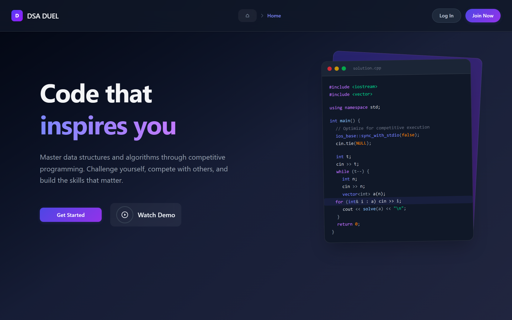
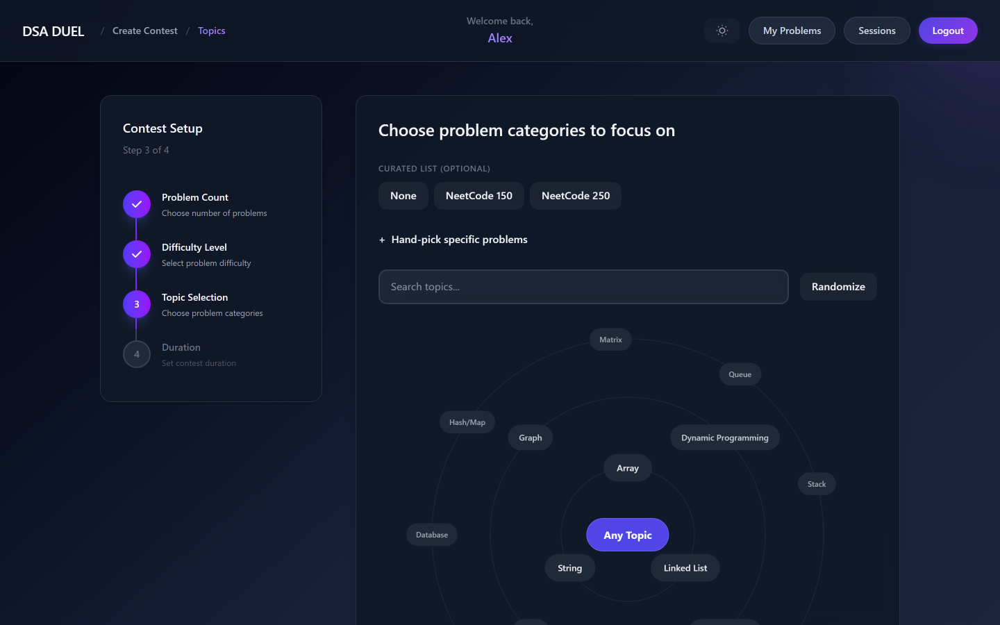
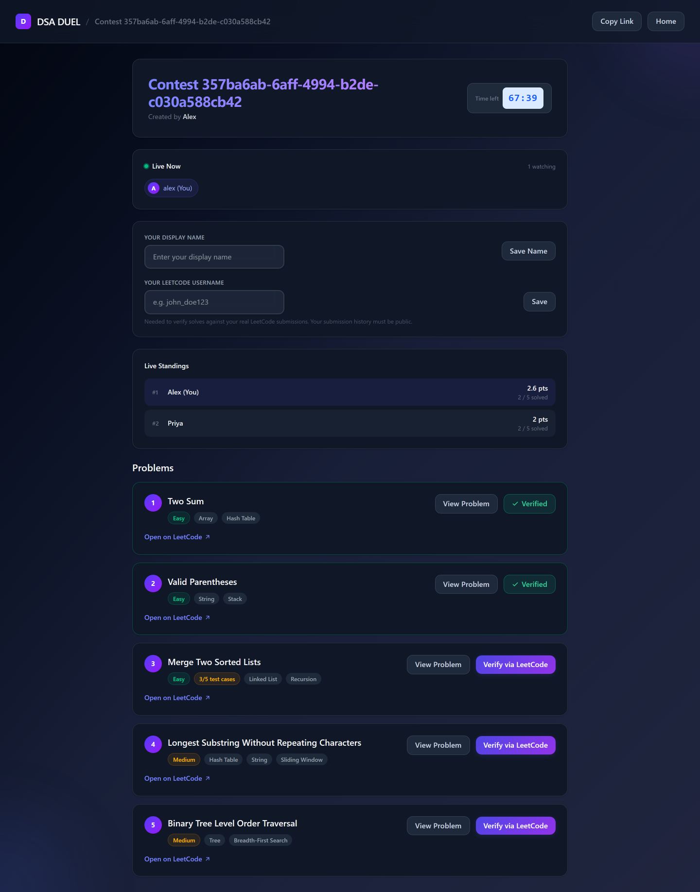
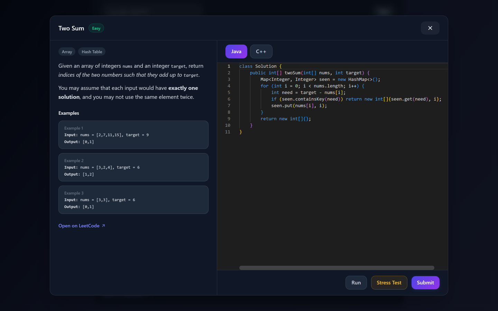
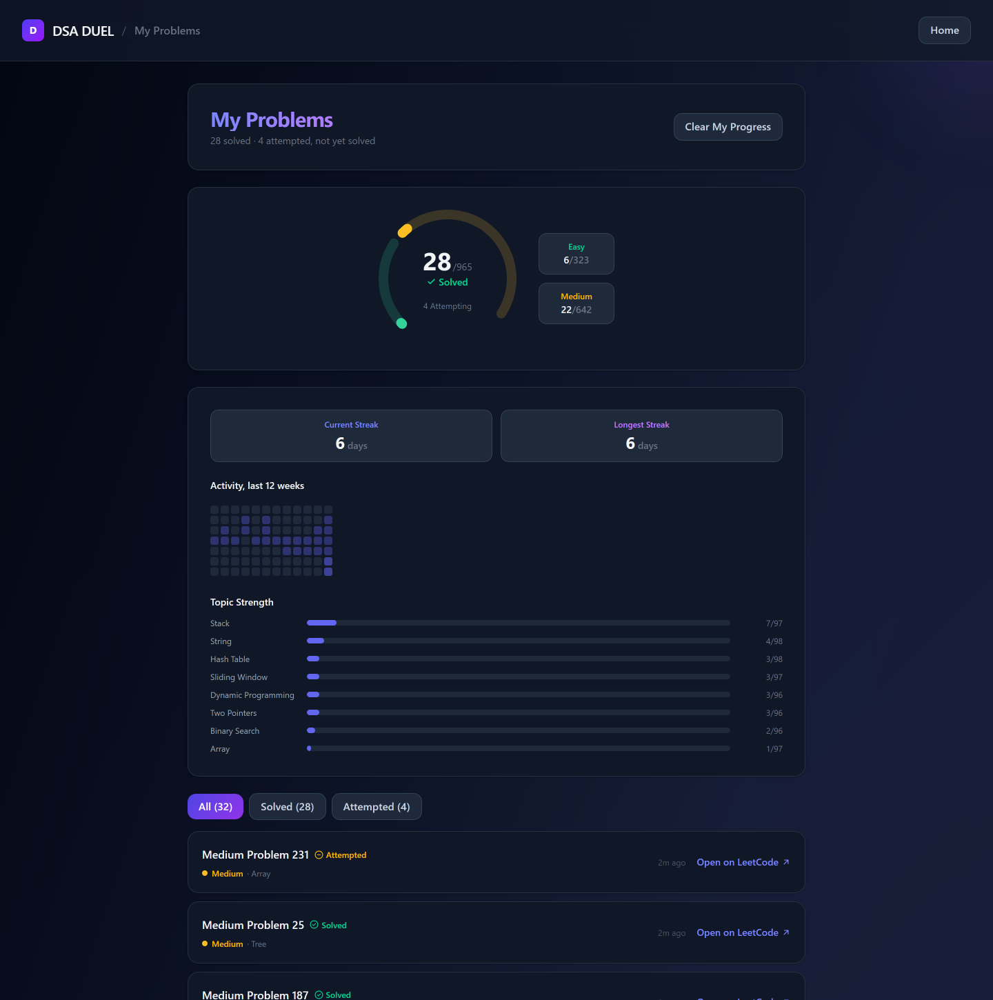

# DSA Duel

**Competitive DSA practice with verified solves.** Spin up a contest, share one link, and compete live — with an in-app judge that actually compiles and runs your code.

🔗 **[dsa-duel.vercel.app](https://dsa-duel.vercel.app)** · API at `api.pradhamlr.me`

> **Note on the live demo:** the backend runs on a VM that's started on demand to conserve cloud credits, so the API may be offline when you visit. The frontend will load either way.



---

## The problem

Interview prep is a grind you do alone. You open LeetCode, pick something semi-randomly, maybe solve it, and there's no accountability and no real signal you're improving.

The existing alternatives don't fit. LeetCode's weekly contest is global, scheduled, and rated — high friction, once a week. VJudge, Codeforces mashups, and AtCoder virtual contests do support custom problem sets, but they're built for competitive programmers, and none of them know or care what you've already solved.

## What makes this different

**Solves are verified, not claimed.** An in-app judge compiles and runs your code against real test cases in Java or C++, or the app checks your actual LeetCode accepted-submission history. There is no honour-system "mark as solved" button — it was deliberately removed.

**Problem selection avoids repeats.** At contest start, the app reads the solve history of everyone currently in the room and steers around what they've recently solved or attempted, via a tiered fallback that relaxes constraints rather than failing.

**Scoring is more than binary.** Partial credit by test cases passed, ICPC-style time tiebreakers, ranked by fractional total score.

---

## Features

### Create a contest in four steps

Problem count, difficulty, topics — plus optional curated pools (NeetCode 150/250) and hand-picking specific problems by search.



### Compete live

Standings and a connected-participants roster update in real time over Server-Sent Events. Below, partial credit decides the ranking: both players have 2 of 5 solved, but 3-of-5 test cases on a third problem puts Alex ahead.



### Solve in-app

A two-pane view with the real problem statement and worked examples beside a Monaco editor. **Run** checks the visible examples, **Submit** scores and marks solved, and **Stress Test** generates boundary cases from the function's type signature to check for crashes.



### Track progress

A solve ring, current and longest streaks, a calendar-aligned activity heatmap, and per-topic strength — all hand-rolled SVG, no charting dependency.



---

## Architecture

```
Browser
  │
  ├─► Vercel CDN ─────────────► React + Vite static build
  │
  └─► api.pradhamlr.me
        │
        ▼
   Caddy :443  ── automatic TLS (Let's Encrypt)
        │
   Node/Express :5000  ── systemd, unprivileged user, hardened
        │
        ├──► Judge0 :2358   (same host, loopback only)
        ├──► PostgreSQL     (Supabase, via session pooler)
        └──► Redis          (Upstash)
```

**Stack:** React · Vite · Tailwind · Monaco · Express · Prisma · PostgreSQL · Redis · Judge0 · Caddy · systemd · GitHub Actions

---

## Notable engineering

**Code-generation judge drivers.** Rather than hand-writing a harness per problem, a recursive type-tree parser reads LeetCode's own type grammar (`integer[][]`, `list<list<integer>>`, `TreeNode`) and generates a complete runnable program per submission — in both Java and C++. Input construction happens at codegen time; output serialization happens at execution time, because the shape of a returned tree isn't known until the code runs.

**Auth.** JWT access tokens plus opaque, database-hashed refresh tokens with rotation and reuse detection. Revocation uses a session-id denylist in Redis, so a revoked session dies immediately rather than remaining valid until its token expires. Registration writes no database row until the email is verified — the pending attempt lives in Redis under a TTL matching the OTP window, so abandoned signups expire on their own.

**Live updates over SSE, not WebSockets.** Every write already goes through authenticated REST with rate limiting; the only real gap was one-directional server→client push, which SSE covers with no new dependencies and free browser-native reconnection.

**Problem classification.** Real LeetCode topic tags resolve ~95% of the catalog with no LLM involved; a Groq model handles only the residual, in a background job fully decoupled from the request path.

---

## Running locally

**Prerequisites:** Node 22, Docker (for Postgres and Redis).

```bash
# Backend
cd Backend
npm install
cp .env.example .env        # then fill in DATABASE_URL, REDIS_URL, JWT_SECRET, ...
npx prisma migrate deploy
npx prisma generate
npm run dev

# Frontend, in a second terminal
cd Client
npm install
echo "VITE_API_BASE=http://localhost:5000" > .env
npm run dev
```

The catalog self-populates on first boot — `syncNewProblems()` fetches from LeetCode's public GraphQL API, so no manual seeding is needed.

The in-app judge additionally requires a reachable [Judge0](https://github.com/judge0/judge0) instance (`JUDGE0_URL`, `JUDGE0_AUTH_TOKEN`). Everything except Run/Submit works without one.

## Tests

```bash
cd Backend
npm test          # 160 tests
```

Integration tests run against **real** Postgres and Redis rather than mocks — rate limiting, the session denylist, and refresh-token rotation are infrastructure behaviours a mock would paper over. A safety guard refuses to run destructive test helpers unless `DATABASE_URL` points at localhost.

CI runs three jobs on every push and pull request: backend tests, client lint + build, and a Playwright end-to-end smoke test.

---

## Operations

- **Deployment:** one health-gated command on the VM — pulls `main`, reinstalls and migrates only when those inputs changed, restarts, then verifies through the public URL before declaring success.
- **Backups:** daily `pg_dump`, GPG-AES256 encrypted, with a **weekly automated restore drill** that decrypts into a throwaway Postgres and asserts on row counts — because "the backup job succeeded" and "the backup is restorable" are different claims.
- **Monitoring:** health checks run *inside* the VM on a systemd timer. Since the host is deliberately offline most of the day, external polling would alert constantly and train the alerts to be ignored; running inside means silence when it's off and a real alert when it's on and broken.
- **Observability:** structured logs (pino → journald) and Sentry for exceptions.

## Known limitations

Documented deliberately rather than discovered later:

- **Single instance.** The SSE connection registry is in-process memory, so the backend cannot be horizontally scaled without moving to Redis pub/sub. This also means no zero-downtime deploys.
- **On-demand availability.** The VM is started when needed rather than run 24/7, to stretch limited cloud credits.
- **Judge submissions are synchronous.** A Judge0 timeout discards completed work; there is no retry or idempotency key. Moving this to a job queue is the highest-value remaining improvement.
- **C++ undefined behaviour** can fail an entire submission rather than one test case, since a segfault takes down the whole process. Accepted as a tradeoff against running each test case as its own sandboxed submission.
- **Never load tested.** Performance is adequate in practice but unmeasured.

## License

No license — all rights reserved. Feel free to read, learn from, and open issues.
